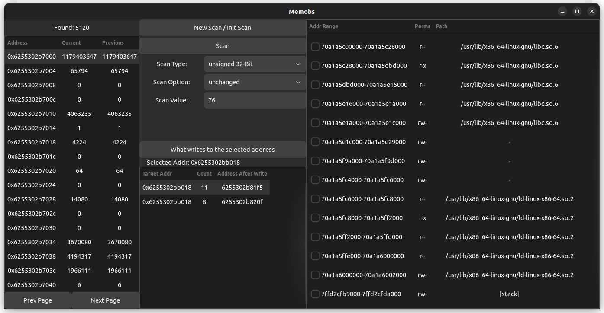

# MEMOBS
Memobs is a [Cheat Engine](https://www.cheatengine.org/) like tool for Linux.

## Main Features
- Select what memory pages are going to be included in your scans.
- Scan the selected memory for changed, unchanged and literal values.
- Find out where the instructions are that write to a selected address.

## Dependencies
Memobs uses GTK4. You can install GTK4 with ``sudo apt install libgtk-4-dev``.

## Building
- Run ``make`` to build Memobs.

## Usage Guide
Memobs expects the pid of the targeted process as a command line parameter. You can for example
run it like this: ``sudo ./memobs $(pidof <target_process_name>)``. You need to launch the
application as super user, since it reads the targeted processes memory and attaches a debugger
to it.

### UI Guide
#### Scanned memory view
The most left section is a table like structure, that displays the scanned memory addresses and
their current and previous values. This view is updated every time the ``Scan`` button is
pressed.

#### Virtual memory page view
The most right section contains all the virtual memory pages of the targeted process. By checking
the check box, you can include this page into the scanning process.

#### Buttons
**New Scan/Init Scan:**
This should be done whenever you want to initialize a new scan. For example if you changed the
scan type or selected different memory pages for scanning.

**Scan:**
After you initialized a new scan, you can iteratively scan the targeted processes memory. The
scan is based on what you set in the ``Scan Type`` and ``Scan Option`` drop down menu. After the
initial scan, the ``Scan Type`` option should not be changed. If the scan option ``value`` was
selected, you need to provide a value in the ``Scan Value`` field. Every scan iteration, the
current values are compared to the ones of the previous scan. If the values don't match the scan
settings, the memory addresses will be removed from future scans. This allows you to reduce the
scanned addresses over time.

**What writes to selected address:**
This function will figure out the memory address of the instructions that write to the selected
address. An address can be selected by left clicking a row in the ``Scan memory view``. The
addresses of the instructions and the amounts of memory writes will be displayed in the table
below.
